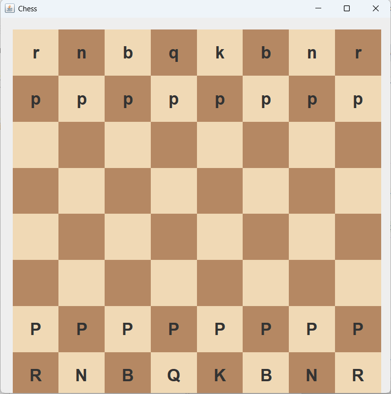
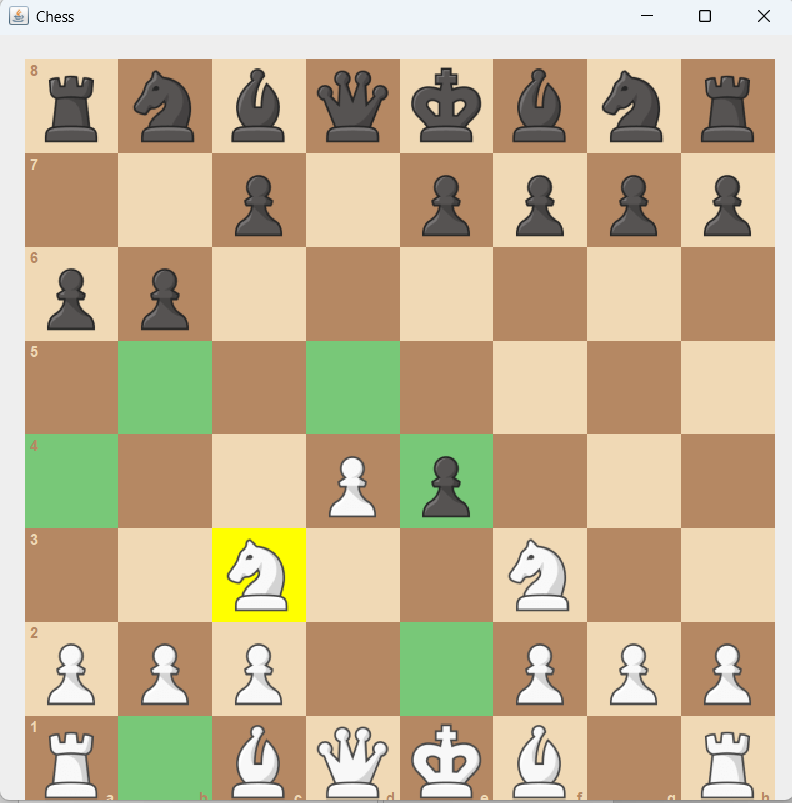

# Java Chess Engine ♟️

A chess engine made in Java using Swing GUI.

## Features

- Legal move generation
- Minimax AI with Alpha-Beta pruning
- Move highlighting
- Last move indication
- Custom chess piece set
- Chessboard coordinates
- GUI improvements inspired by Chess.com

## Before vs After

### Before

### After

## Tech Used

- Java
- Swing
- Object-Oriented Programming
- Minimax Search
- Alpha-Beta Pruning

## Future Improvements

- Pawn promotion choices
- Threefold repetition
- Fifty-move rule
- Opening book
- Better evaluation function
- Move animations
